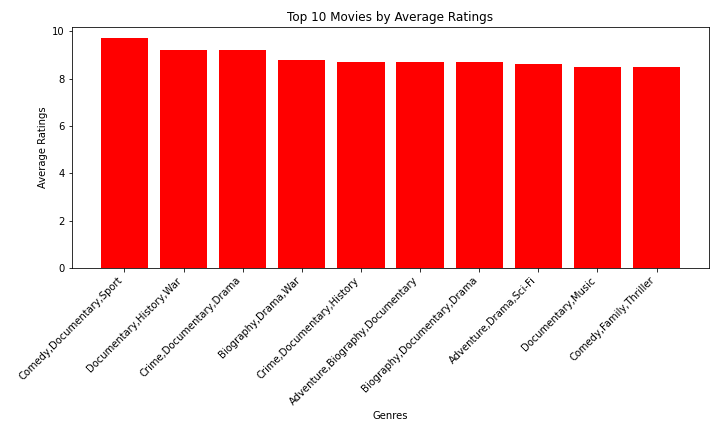
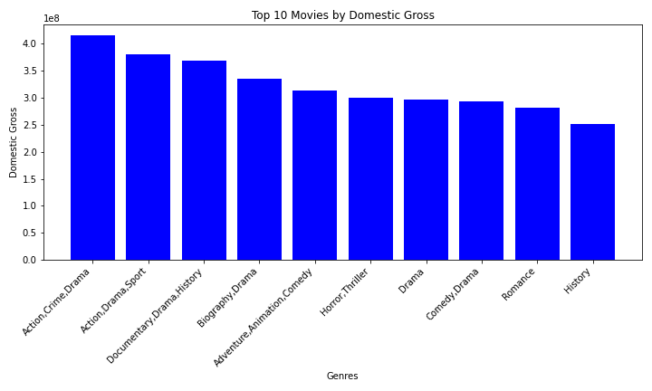
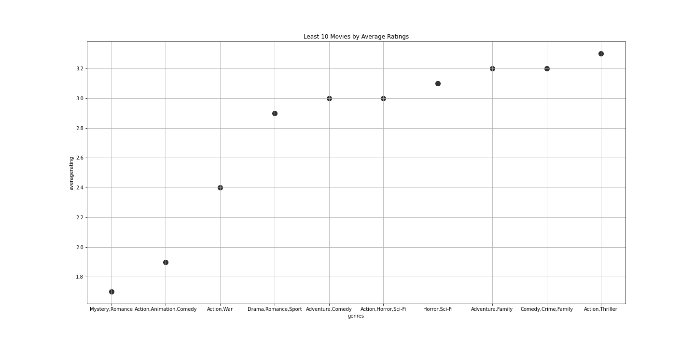
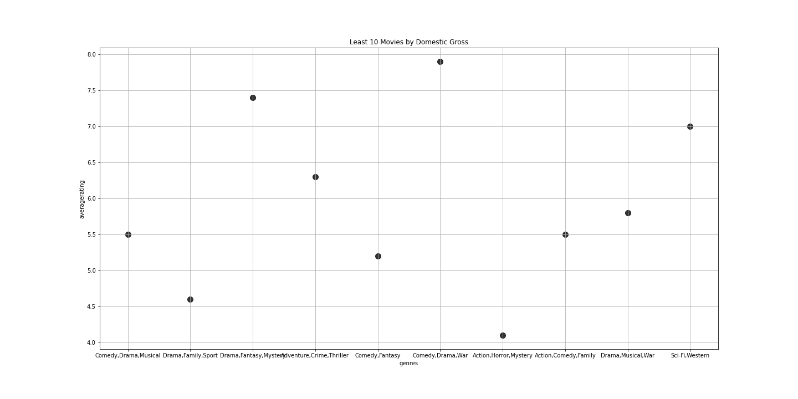

# Phase 1 Project: Microsoft Movie Studios - Movie Analysis

# Student Information
Student name: Stephen Kimiti
Student pace: Part time
Scheduled project review date/time: 24.July.2023
Instructor name: Maryanne Mwikali
Blog post URL: https: //www.boxofficemojo.com/
​
movies anywhere.png
image = Image.open("movies anywhere.png")
width = 900
height = 300
resized_image = image.resize((width, height))
resized_image

# Overview
This project involves exploratory data analysis to generate movie insights for Microsoft Corporation. The aim is to help Microsoft's new movie studio decide what type of films to create based on current box office trends and successful film genres.

# Business Problem
Microsoft plans to venture into the movie industry by creating a new movie studio. They lack knowledge about movie-making and want to understand what types of films are currently successful at the box office. The project aims to provide actionable insights to help Microsoft's stakeholders make informed decisions about the types of films they should produce.

# Data Understanding
The analysis is based on data from Box Office Mojo, a reputable online source providing comprehensive information on box office performance, film genres, release dates, and critical reception. By analyzing this data, the project aims to identify successful film genres and current box office trends to guide Microsoft's new movie studio.

# movies Dataset
The movies dataset includes movies released from 2010 to 2018, and includes a wide variety of movie title, movie studio, movie genre, movie ratings, domestic and foreign gross.

# Data Preparation
The movies dataset, containing films released from 2010 to 2018, includes information such as domestic gross, movie genres, average ratings, and number of votes. The data is cleaned and merged to create a single dataset for analysis.

# Data Modeling
The analysis focuses on identifying the top movie genres based on domestic gross and average ratings. The top 10 movies by average ratings and domestic gross are visualized to provide insights into successful film genres.

# Create the bar chart showing Top 10 Movies by Average Ratings

# Create the bar chart showing Top 10 Movies by Domestic Gross

# Create the scatter graph showing Least 10 Movies by Average Ratings

# Create the Scatter chart showing Least 10 Movies by Domestic Gross

# Evaluation & Conclusion
Based on the visualizations, it is recommended that Microsoft prioritize film genres based on domestic gross rather than ratings. 'Action,Crime,Drama' emerged as the genre with the highest domestic gross. The project's findings will help Microsoft's new movie studio make informed decisions about the types of films to create in order to achieve success in the movie industry.
​

